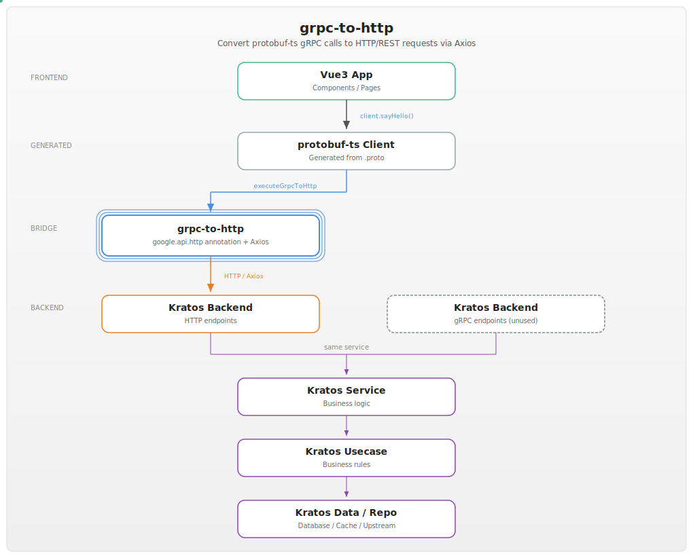

# grpc-to-http

Convert a TypeScript gRPC client into an HTTP client using Axios.

---



---

## CHINESE README

[中文说明](README.zh.md)

## Features

- Convert protobuf-ts generated gRPC client invocations to HTTP/REST requests
- Use Axios as the HTTP engine
- Automatic path param extraction and rewriting
- GET/POST/PUT/DELETE methods via `google.api.http` annotations
- Snake_case to camelCase param name auto-conversion
- Lightweight with minimum dependencies

## Design

When using [protobuf-ts](https://github.com/timostamm/protobuf-ts) to generate TypeScript gRPC clients, the generated code uses `stackIntercept` and `UnaryCall` as gRPC mechanisms. This package provides `executeGrpcToHttp` and `GrpcToHttpPromise` as drop-in replacements that route requests through HTTP/REST endpoints using Axios instead.

The conversion reads `google.api.http` annotations from `.proto` files to decide:
- HTTP method (GET/POST/PUT/DELETE)
- URL path (with param substitution)
- Request payload handling

This is most convenient when the backend (e.g., [Kratos](https://github.com/go-kratos/kratos)) exposes both gRPC and HTTP endpoints, and the frontend uses HTTP without configuring a gRPC bridge.

## Related Projects

- [kratos-vue3](https://github.com/yylego/kratos-vue3) — Go package that integrates Vue3 frontend with Kratos backend, using this package to bridge gRPC and HTTP
- [kratos-vue3-demo](https://github.com/kratos-examples/vue3) — Complete demo project showing how to use grpc-to-http with Kratos and Vue3

## Setup

```bash
npm install @yylego/grpc-to-http
```

## Usage

Import from the package:

```typescript
import { executeGrpcToHttp, GrpcToHttpException, grpcToHttpConfig } from '@yylego/grpc-to-http';
import type { GrpcToHttpPromise } from '@yylego/grpc-to-http';
```

### API

**`executeGrpcToHttp<I, O>(callType, transport, method, options, input)`**

Execute a gRPC request via HTTP. Arguments:

| Argument | Type | Description |
|----------|------|-------------|
| `callType` | `string` | The gRPC request type (e.g., "unary") |
| `transport` | `RpcTransport` | The protobuf-ts transport mechanism |
| `method` | `MethodInfo<I, O>` | The method info from protobuf-ts |
| `options` | `RpcOptions` | Options including `baseUrl` and `meta` (headers) |
| `input` | `I` | The request input object |

Returns `GrpcToHttpPromise<I, O>` — a Promise that resolves to an Axios response.

**`grpcToHttpConfig`**

Configuration object. Supported options:

| Option | Type | Default | Description |
|--------|------|---------|-------------|
| `debug` | `boolean` | `false` | When `true`, prints request details to console |

**`GrpcToHttpException`**

Custom exception class thrown when conversion encounters issues (e.g., missing HTTP method annotation, missing path parameters). Use `instanceof` to distinguish from network exceptions:

```typescript
import { GrpcToHttpException } from '@yylego/grpc-to-http';

try {
    const response = await client.sayHello({ name: 'World' }, options);
} catch (e) {
    if (e instanceof GrpcToHttpException) {
        console.log('Conversion exception:', e.message);
    } else {
        console.log('Network exception:', e);
    }
}
```

**Debug Output**

When `grpcToHttpConfig.debug = true`, two lines are printed for each request:

```
[grpc-to-http] method=SayHello params={"name":"World"}
[grpc-to-http] method=SayHello params={"name":"World"} POST http://localhost:8000/api/hello
```

The first line is printed on request entrance, the second line is printed once the HTTP request is constructed.

### Code Sample

```typescript
// In a Vue component
import { executeGrpcToHttp, grpcToHttpConfig } from '@yylego/grpc-to-http';

// Enable debug mode (optional)
grpcToHttpConfig.debug = true;

const options: RpcOptions = {
    baseUrl: 'http://localhost:8000',
    meta: {
        'Authorization': 'token-value-here'
    }
};

// The generated client uses HTTP instead of gRPC
const response = await client.sayHello({ name: 'World' }, options);
```

## Lint

```bash
npx tsc --noEmit
```

## Publish

```bash
npm publish --access=public
```

---

## Previous Version

This package was once published as [@yyle88/grpt](https://www.npmjs.com/package/@yyle88/grpt) on the [yyle88](https://github.com/yyle88) account.

The `yyle88` account has been suspended, so `@yyle88/grpt` is discontinued. Please use `@yylego/grpc-to-http` instead.

---

## 📄 License

MIT License - see [LICENSE](LICENSE).

---

## 💬 Contact & Feedback

Contributions welcome! Submit bugs, suggest features, and contribute code:

- 🐛 **Mistake found?** Open an issue on GitHub with reproduction steps
- 💡 **New ideas?** Create an issue to discuss
- 📖 **Documentation confusing?** Let us know so we can make improvements
- 🚀 **Need new features?** Describe the use case to help us understand
- ⚡ **Performance issue?** Help us optimize through detailed reports
- 📢 **Want updates?** Watch the repo to get new releases and features
- 💬 **Feedback?** We welcome suggestions and comments

---

## 🔧 Development

New code contributions, follow this process:

1. **Fork**: Fork the repo on GitHub (using the webpage UI).
2. **Clone**: Clone the forked project (`git clone https://github.com/username/grpc-to-http.git`).
3. **Navigate**: Navigate to the cloned project (`cd grpc-to-http`)
4. **Branch**: Create a feature branch (`git checkout -b feature/xxx`).
5. **Code**: Implement the changes with comprehensive tests
6. **Testing**: Run `npx tsc --noEmit` to check TypeScript compilation
7. **Documentation**: Update documentation to match client-facing changes
8. **Stage**: Stage changes (`git add .`)
9. **Commit**: Commit changes (`git commit -m "Add feature xxx"`)
10. **Push**: Push to the branch (`git push origin feature/xxx`).
11. **PR**: Open a merge request on GitHub (on the GitHub webpage) with a detailed description.

Please make tests pass and include documentation updates.

---

## 🌟 Support

Welcome to contribute to this project via submitting merge requests and reporting issues.

**Project Support:**

- ⭐ **Give GitHub Stars** if this project helps
- 🤝 **Share with teammates** who use protobuf-ts with HTTP backends
- 📝 **Write tech posts** about gRPC-to-HTTP conversion workflows
- 🌟 **Join the ecosystem** - committed to supporting open source and the frontend development scene

**Have Fun Coding with this package!** 🎉🎉🎉
